   

## 引言

你如果寫了 Google App Script，想做成 Add-on 上架到 Google Workspace Marketplace，最容易卡的不是程式，而是 OAuth、部署 ID、審核流程。

這些設定分散又繁瑣，一不注意就被退件。

這篇整理完整 Google App Script 上架流程與 OAuth 設定，讓你一次走完，不再卡關。

## 🎯 目標說明

本篇將帶你完成：

- 建立 App Script 專案
- 設定 OAuth 同意畫面
- 測試 Add-on
- 發布至 Google Workspace Marketplace
## 核心流程（步驟拆解）

### 步驟一：建立 App Script 與部署

1. 建立 App Script
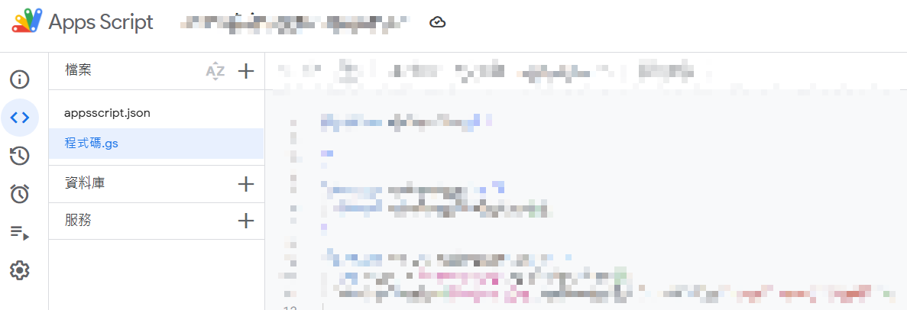

1. 開啟 appscript.json & 指定 GCP 專案編號
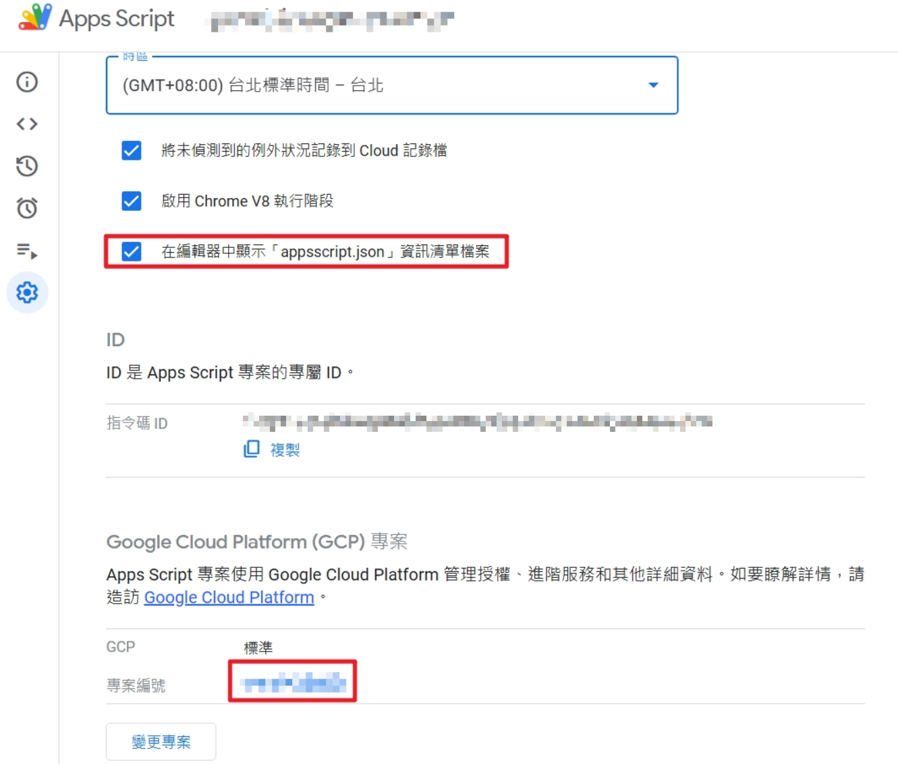

1. 部署→新增部署
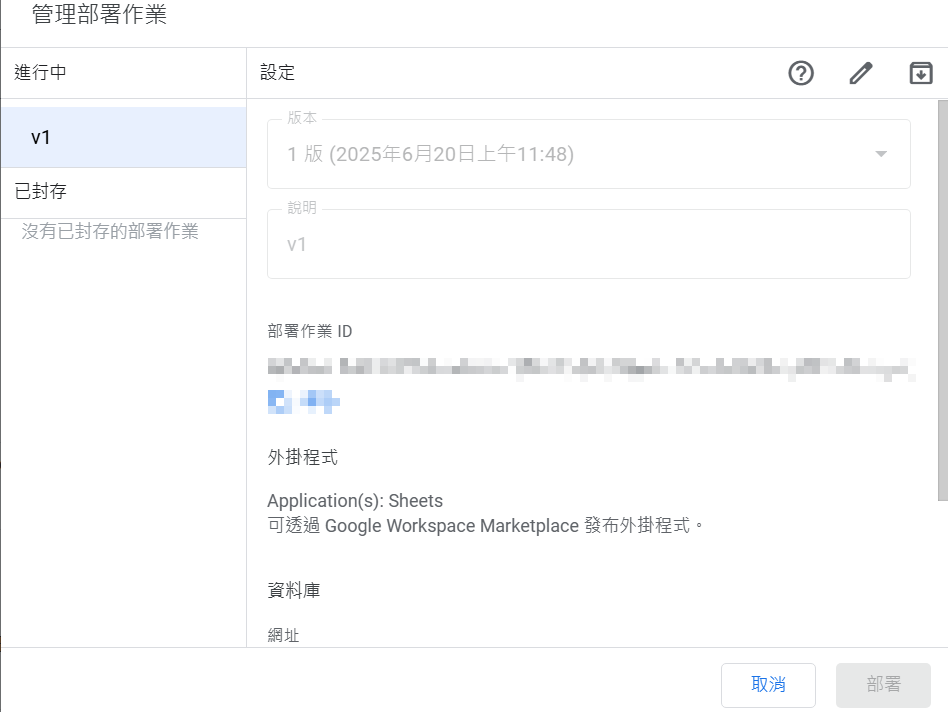

1. 部署→測試部署 (開發測試)
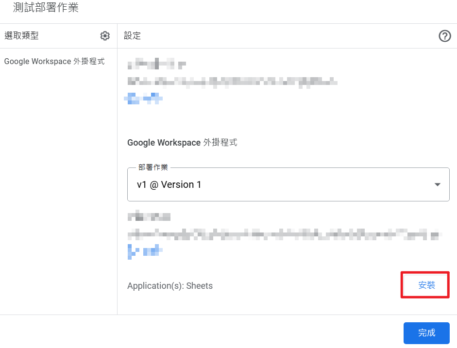

### 步驟二：設定 OAuth 權限

### 設定 Branding（OAuth 同意畫面）

需填寫：

- App Name：需與 Add-On 套件一致
- App domain：需架設一個介紹網站，內容需包含隱私條件、服務條款 (可用自己的 domain / 放在 github.io)
- Authorized domains：放 App domain 使用的網域
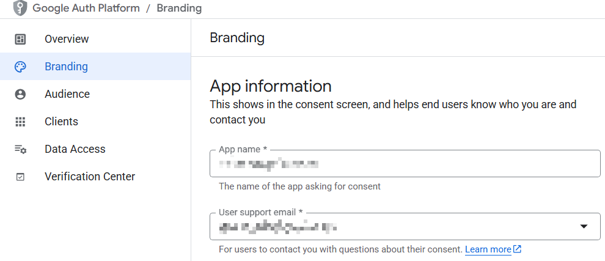

**背後原理**

- Google 透過 OAuth 畫面驗證應用可信度
- 審核重點在這裡
### 步驟三：Marketplace 上架設定

1. 啟用「**Google Workspace Marketplace SDK**」服務
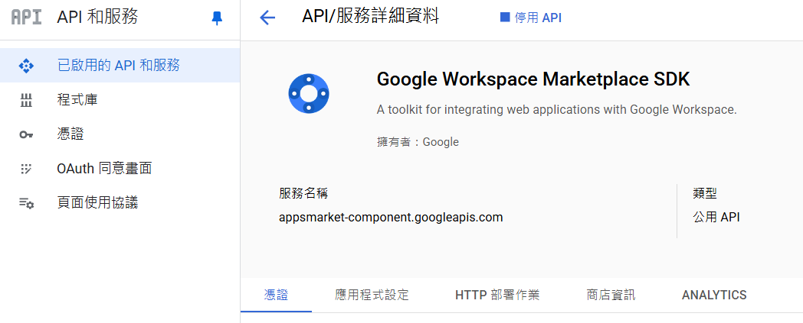

1. 兩個分頁內都需填寫：設定 App Scripts的部署ID、開發者資訊、商品資訊
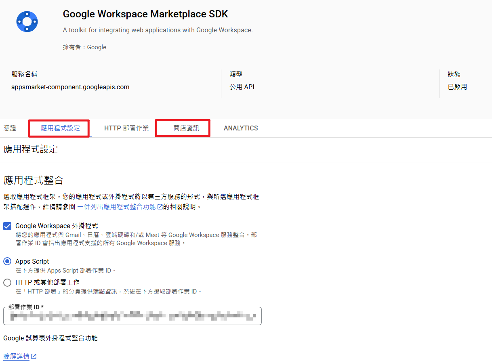

1. 商店資訊→瀏覽 MARKETPLACE：上架前測試。該頁填寫「草稿測試人員」的Mail
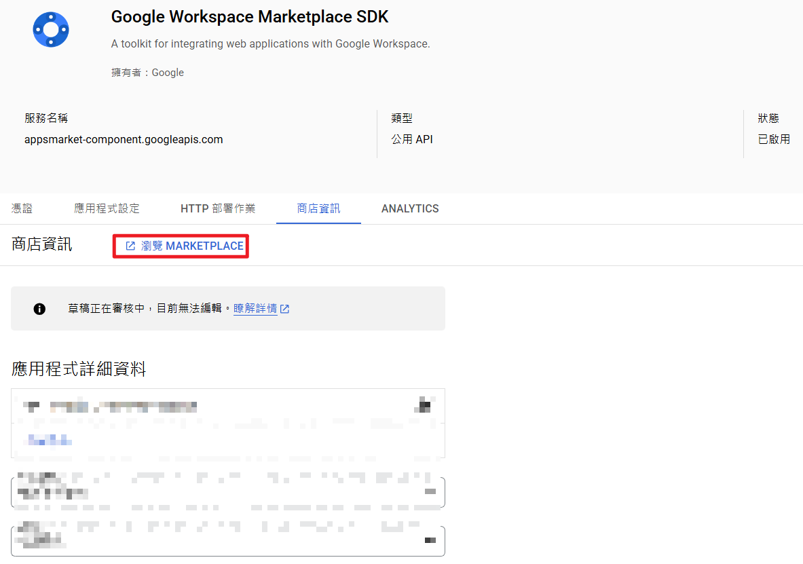

1. 想測試還需要設定 OAuth 的測試：OAuth 同意畫面→目標對象→測試使用者 + Add
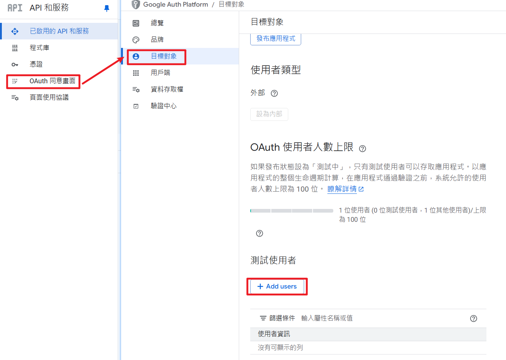

1. 測試完回到「商店資訊」：送出審核
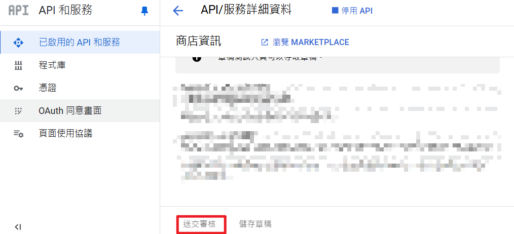

1. OAUTH 切換至 Production
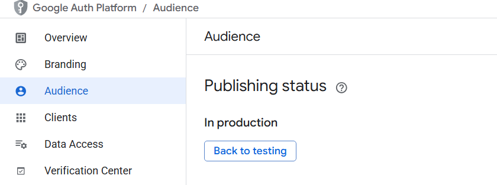

1. 最後~ 就等 GOOGLE 審核結果
## ⚠️ 常見問題 / 踩坑

### OAuth 被退件

- 沒有隱私權政策
- Domain 不一致
### 無法測試 Add-on

- 未加入測試使用者
### 上架失敗

- Deployment ID 錯誤
- OAuth 尚未 Production
- 文字使用到 GOOGLE的產品需加™
(e.g. Google Sheets™、Google Workspace™)
## 總結

這篇帶你走完：

- App Script 建立與部署
- OAuth 設定
- Marketplace 上架流程
關鍵重點：

1. OAuth 設定是最大關鍵
1. 測試流程不能省
1. Marketplace 資訊要完整
