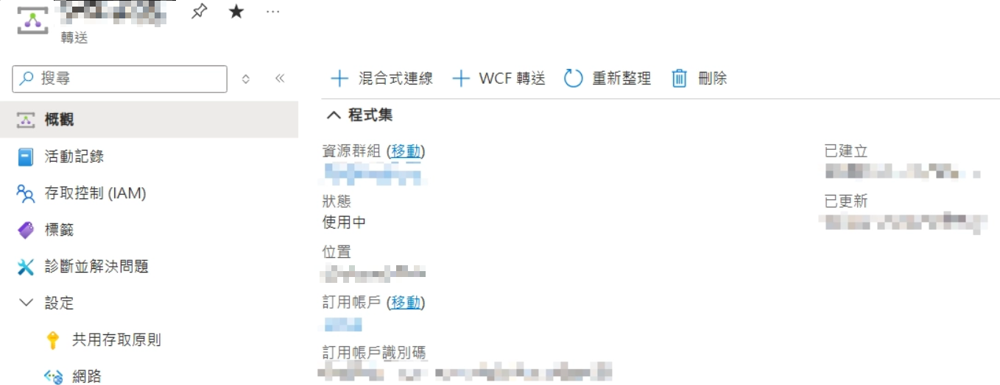
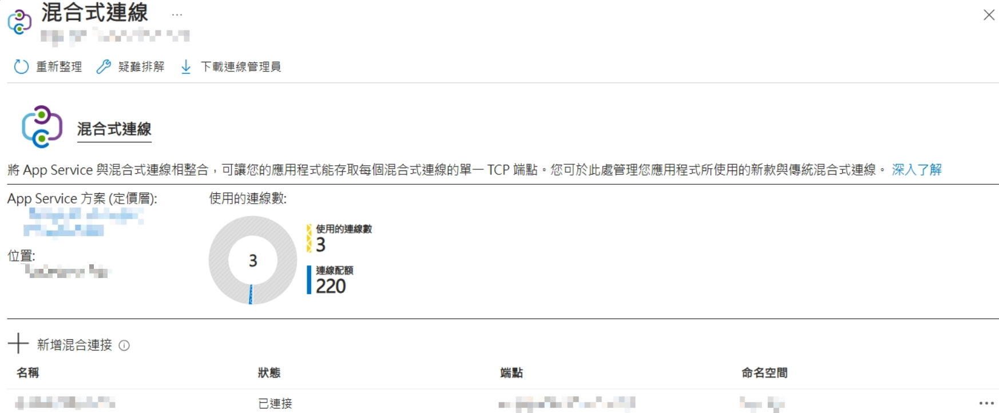
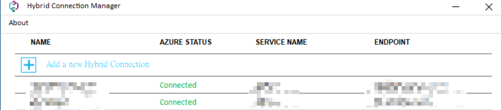

  
## Conclusion

- Using Hybrid Connection allows Azure Web Apps to securely connect back to on-premises services **without opening a VPN or exposing IPs**.
## Where It's Suitable

- Web Apps needing to connect to on-premises DB / API
- Not wanting to open a VPN or Public IP
- Corporate internal network services that cannot be exposed externally
- Wanting to quickly establish cloud-to-on-premises connectivity (low operational cost)
## Steps

### 1. Create a Hybrid Connection (Cloud Side)

- Create a Hybrid Connection in the Azure Portal
- Configure the target:
  - Host (on-premises service IP / hostname)
  - Port (e.g., 1433 / 80 / 443)
- Essentially, Azure creates a 'relay channel' for you, not a direct connection


### 2. Bind Web App to Hybrid Connection

- Go to Web App → Networking → Hybrid Connections
- Add the Hybrid Connection you just created
- Once bound, when the Web App accesses that Host:Port, it will automatically use this channel


### 3. Install Connection Manager On-premises

- Install Hybrid Connection Manager (HCM)
- Log in with your Azure account and select the Hybrid Connection
- HCM will actively 'establish an outbound connection to Azure' (key point)
- No need to open inbound ports (less firewall pressure)


### 4. Verify Connection

- Web App directly uses:
  - Host (the configured name)
  - Port
- No need to change DNS, no need to change application architecture
- Success means the cloud → on-premises channel has been established
## Additional Notes

- HCM **initiates outbound connections**, so no need to open inbound firewall ports (common misconception)
- Only supports TCP, not UDP
- If unable to connect, first check:
  - If HCM is Online
  - If the Port is correct
  - If the on-premises service allows local connections
## Commands / Examples

<details>
<summary>Click to expand</summary>

```plain text
# 測試連線（Web App Console）
tcpping your-host 1433

# 常見 DB 連線字串（範例）
Server=your-host,1433;Database=DB;User Id=xxx;Password=xxx;
```

</details>

## Wrap-up

- Hybrid Connection is like a 'secretly drilled secure tunnel' that works reliably without a VPN; first ensure HCM is online, then address other issues.
## References

[https://learn.microsoft.com/azure/app-service/app-service-hybrid-connections](https://learn.microsoft.com/azure/app-service/app-service-hybrid-connections)
