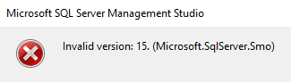

   

## Conclusion

- Outdated SMO versions cannot parse new SQL Server versions (v16); updating SSMS will resolve this.
## Where This Applies

- Retrieving Table / View Scripts using SMO
- Automating SQL Schema Generation
- Environments using older SSMS / older SDKs
- Encountering "version 16" / "version not supported" errors
## Steps

### 1. Identify the Error Source (SMO Version Not Supported)

- When executing to get Create Table / View scripts, `invalid version 16` appears.
- This means SMO cannot recognize SQL Server 2022 (v16).
- Commonly seen in:
  - Older SSMS versions
  - Older NuGet packages: Microsoft.SqlServer.Smo


### 2. Update SSMS (Quickest Solution)

- Download the latest SSMS from Microsoft's official website.
- After installation, SMO-related components will be automatically updated.
- Why:
  - SMO versions are tied to SSMS.
  - Newer SSMS versions support SQL Server 2022+.
### 3. (Programmatically) Update NuGet Packages (If Using SMO)

- Update the SMO package version.
```powershell
# 更新 SMO 套件
dotnet add package Microsoft.SqlServer.SqlManagementObjects
```

- Ensure the version is >= supporting SQL Server 2022.
## Additional Notes

- SSMS and SQL Server versions **do not need to match, but SSMS cannot be too old**.
- SMO is very sensitive to versions; it's not a DB issue, but a client issue.
- If SMO is used in CI/CD, the packages must also be upgraded synchronously.
## Wrap-up

- When you see "version 16", don't doubt yourself; nine times out of ten, your tools are too old. Just update them.
