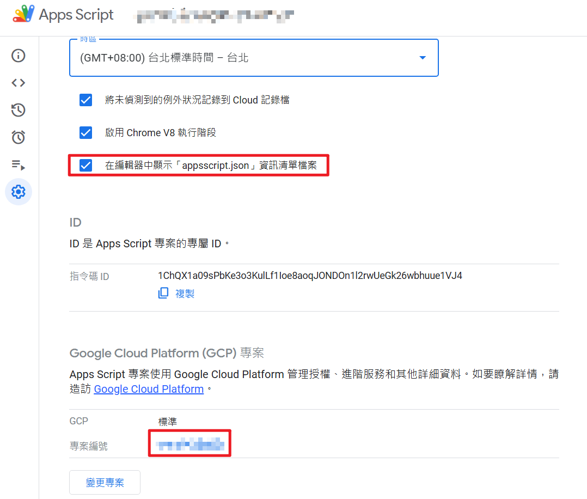

 
## Introduction

If you've written a Google App Script and want to turn it into an Add-on for the Google Workspace Marketplace, the most common hurdles aren't the code itself, but rather OAuth, deployment IDs, and the review process.

These settings are scattered and cumbersome, and a single oversight can lead to rejection.

This post compiles the complete Google App Script publishing process and OAuth setup, guiding you through it all at once so you won't get stuck again.

## 🎯 Objectives

This post will guide you through:

- Creating an App Script project
- Configuring the OAuth consent screen
- Testing your Add-on
- Publishing to the Google Workspace Marketplace
## Core Process (Step-by-step Breakdown)

### Step One: Create and Deploy App Script

1. Create App Script

1. Open `appscript.json` & Specify GCP Project Number

1. Deploy → New deployment

1. Deploy → Test deployments (Development testing)

### Step Two: Configure OAuth Permissions

### Configure Branding (OAuth Consent Screen)

You need to fill in:

- App Name: Must match the Add-On package name
- App domain: Requires a promotional website that includes a privacy policy and terms of service (can use your own domain / host on github.io)
- Authorized domains: The domain used by your App domain

**Underlying Principle**

- Google verifies application trustworthiness through the OAuth consent screen
- The review focuses heavily on this section
### Step Three: Marketplace Publishing Settings

1. Enable the "**Google Workspace Marketplace SDK**" service

1. Both tabs require filling in: App Script Deployment ID, developer information, and product information

1. Store Listing → Browse MARKETPLACE: Pre-publishing test. On this page, fill in the email addresses of "Draft testers"

1. To test, you also need to configure OAuth testing: OAuth consent screen → User type → Test users + Add

1. After testing, return to "Store Listing": Submit for review

1. Switch OAuth to Production

1. Finally~ Await Google's review results
## ⚠️ Common Issues / Pitfalls

### OAuth Rejection

- Missing privacy policy
- Inconsistent domain
### Unable to Test Add-on

- Test users not added
### Publishing Failure

- Incorrect Deployment ID
- OAuth not yet in Production
- Google product names in text require ™
(e.g., Google Sheets™, Google Workspace™)
## Summary

This post guided you through:

- App Script creation and deployment
- OAuth configuration
- Marketplace publishing process
Key takeaways:

1. OAuth configuration is the most crucial step
1. The testing process cannot be skipped
1. Marketplace information must be complete